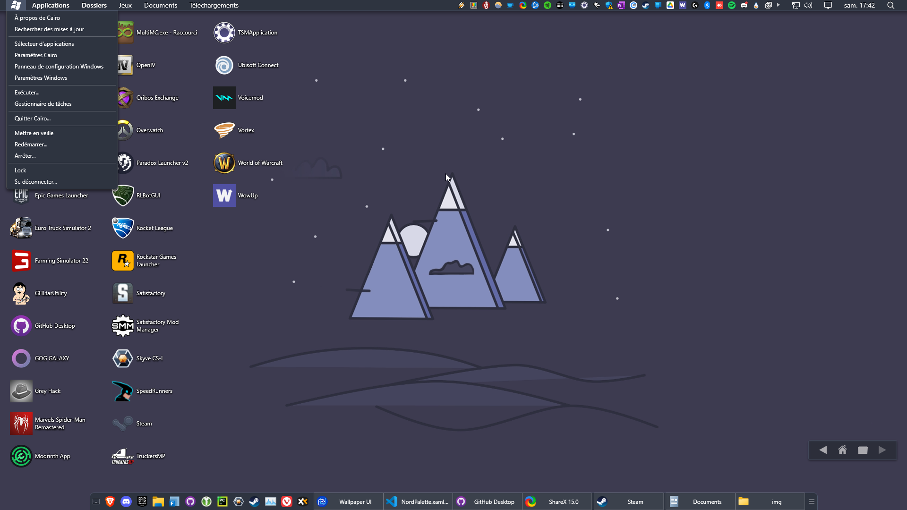

# Nord-for-CairoShell
Nord theme for CairoShell

Adapté du theme Flat de CairoShell  
https://github.com/cairoshell/cairoshell/blob/master/Cairo%20Desktop/Cairo%20Desktop/Themes/Flat.xaml 
Windows ico: 
https://www.iconsdb.com/white-icons/os-windows-icon.html  
Documentation:  
https://github.com/cairoshell/cairoshell/wiki/Creating-Themes  
 
A installer dans le dossier `%LOCALAPPDATA%\Cairo_Development_Team\Themes`

